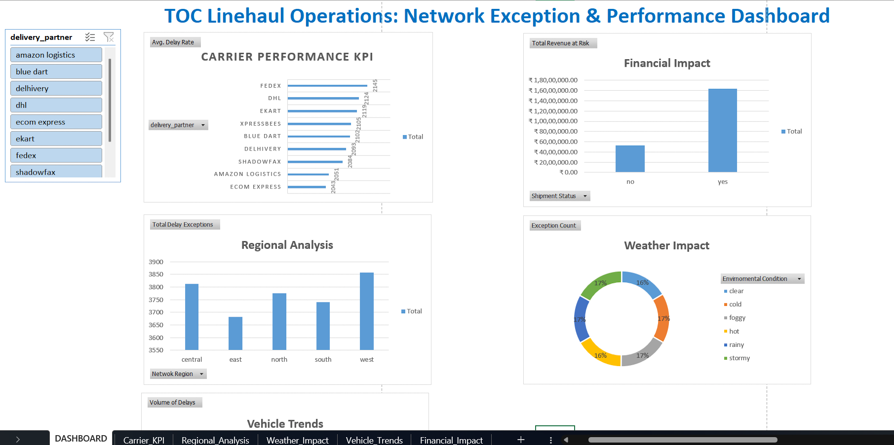

# TOC Linehaul Operations: Network Exception & Optimization Dashboard

## 📌 Project Overview
This project focuses on **Logistics Data Analysis and Optimization** for a high-volume delivery network of 25,000+ shipments. By leveraging **SQL** for backend data processing and **Excel** for executive-level visualization, I identified critical operational bottlenecks and quantified the financial impact of delivery exceptions.

The primary goal was to provide the **Transportation Operations Center (TOC)** with an interactive tool to monitor carrier performance, regional risks, and weather-driven disruptions in real-time.

---

## 📊 Dashboard Preview

---

## 🛠️ Technical Workflow & SQL Implementation
I transformed raw, unstructured shipment data into actionable insights using advanced SQL techniques:

| SQL Technique | Application in Project |
| :--- | :--- |
| **Aggregations** | Utilized `COUNT`, `SUM`, and `AVG` to calculate total volumes and cost metrics. |
| **Conditional Logic** | Implemented `CASE WHEN` statements to categorize "Exceptions" and determine `is_delayed` status. |
| **Data Normalization** | Developed mathematical formulas within queries to calculate `delay_percentage` for carriers. |
| **Trend Identification** | Used `GROUP BY` and `ORDER BY` to rank geographic and environmental bottlenecks. |

---

## 💡 Key Business Insights

### 💰 Financial Impact
* **Revenue at Risk:** Delayed shipments account for over **16.3 Million** in potential revenue loss.
* **High-Value Vulnerability:** Delayed shipments have a higher average value (**866**) than on-time ones, indicating that high-priority freight is disproportionately affected.

### 🌪️ Operational Bottlenecks
* **Weather Sensitivity:** Environmental conditions are primary drivers of failure. **Foggy** and **Cold** weather alone resulted in over **6,300 cumulative exceptions**.
* **Regional Risk:** The **West Region** is the highest-risk zone, recording **3,857 total late counts**, the highest in the network.

### 🚚 Carrier Performance
* **Top Performer:** **Xpressbees** maintained the highest reliability with a **74.49%** on-time rate.
* **Underperformers:** **Shadowfax** and **FedEx** struggled, with delay rates exceeding **76%**.

---

## 🚀 Optimization & Recommendations

Based on the data-driven findings, the following optimizations are proposed:

1. **Carrier Re-Allocation:** Shift high-value linehaul volume toward **Xpressbees** and **Ecom Express** to stabilize network reliability.
2. **Proactive Weather Routing:** Deploy agile vehicle types, such as **EV Bikes**, in urban "West" regions during foggy conditions to bypass heavy-vehicle congestion.
3. **Revenue Protection:** Implement a "High-Value Recovery" protocol for shipments valued **>$860**, as these represent the largest share of delayed revenue.

---
